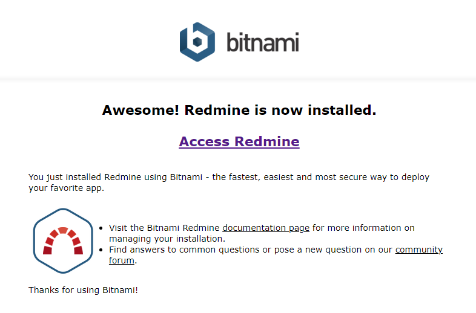

作成日:2021/07/09
# Amazon Linux 2にredmine(bitnami)をインストール

|名前|version|
|----|----|
|Redmine|4.2.1.stable
|Ruby|2.6.7-p197 (2021-04-05) [x86_64-linux]|
|Rails|5.2.5|

## 00-a. 事前準備(AWSコンソール側)
外部からブラウザへアクセスできるように、インスタンスに紐づけられているセキュリティグループにSSH, HTTP, HTTPSを追加しておく。

## 00-b. 事前準備(ターミナル側)
	$ yum update

## 01. Swap領域の拡張
Amazon Linux 2のt2.microインスタンスだとメモリが1GBしかないため、bitnamiインストール時にメモリ不足となる。(bitnamiインストールは2GB必要とのこと)  
デフォルトのSwap領域は0KBなので、これを1024MBに拡張する。

	$ dd if=/dev/zero of=/tmp/swap.img bs=1M count=1024
	$ chmod 600 /tmp/swap.img
	$ mkswap /tmp/swap.img
	$ swapon /tmp/swap.img
	$ free -h
(表示例)
> [ec2-user@redmine ~]$ free -h  
>               total        used        free      shared  buff/cache   available  
> Mem:           982M        623M         70M        3.2M        288M        218M  
> Swap:          1.0G          0B        1.0G

## 02. ncurses-compat-libsのインストール
MySQL接続時に必要。

	$ yum install ncurses-compat-libs

※これを入れないと、bitnamiインストール時に下記エラーが出力されるので、上記コマンドを先に実行すること。  
(表示例)
> bin/mysql.bin: error while loading shared libraries: libtinfo.so.5: cannot open  
> shared object file: No such file or directory

## 03. bitnamiダウンロード
	$ wget https://bitnami.com/redirect/to/1552362/bitnami-redmine-4.2.1-2-linux-x64-installer.run
	$ chmod 777 bitnami-redmine-4.2.1-2-linux-x64-installer.run; ls -l

(表示例)
> -rwxrwxrwx 1 root root 265976248 Jun 25 05:01 bitnami-redmine-4.2.1-2-linux-x64-installer.run

## 04. bitnamiインストール
	$ ./bitnami-redmine-4.2.1-2-linux-x64-installer.run

下記でインストール先フォルダは/opt/redmineにすること
※ディレクトリ名にドットやハイフンがあるとインストールが上手くいかないことがある  

(表示例)
> ----------------------------------------------------------------------------  
> Installation folder  
> 
> Bitnami Redmine Stack をインストールするフォルダを選択してください。  
> 
> フォルダを選択 [/opt/redmine-4.2.1-2]: /opt/redmine  
> 
> 
> ...(中略)  
> 
>  インストール中  
>  0% ______________ 50% ______________ 100%  
>  #########################################  
> 
> ----------------------------------------------------------------------------  
> セットアップウィザードによる Bitnami Redmine Stack のインストールが完了しました  
> 
> Redmine アプリケーション起動 [Y/n]: y  
> 
> 情報: Bitnami Redmine Stack については、ブラウザで  
> http://127.0.0.1:80 にアクセスしてください。  
> 続けるには [Enter] キーを押してください ：  
> 

インストールしたいコンポーネント(Git等)はお好みで。  
管理者ユーザ名とそのパスワード、メールアドレスを入力し、エラーなくインストール完了したらブラウザにアクセスする。  
下記画像が表示されればok

